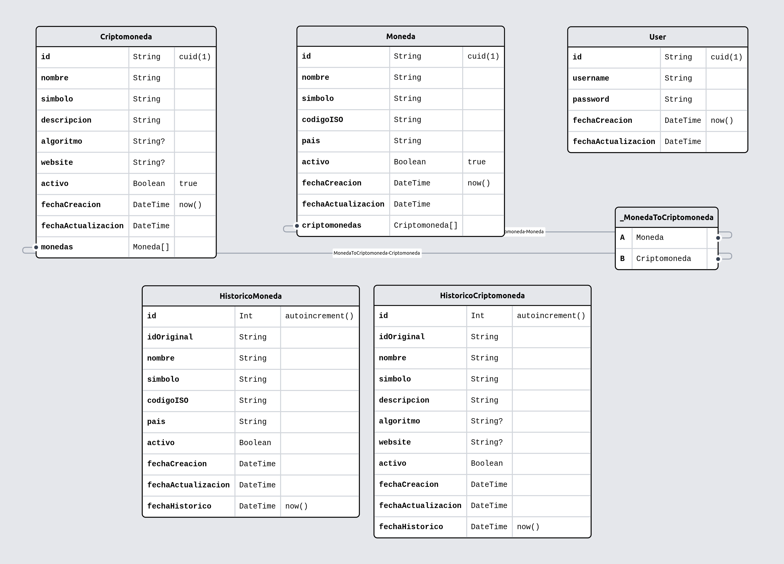

# Banking Technologies Consulting - Backend Service

### Es un servicio que permite ingresar monedas y cryptomonedas asociadas, previa autorizacion de usuario

#### Instrucciones de instalacion

1. Unico requisito: Tener instalado node
2. El repositorio esta ubicado en: xyz. Se puede descargar con el comando de GIT: git clone xyz. Luego en la carpeta raiz del proyecto, se debe ejecutar el comando: pnpm install, con lo cual se instalaran las dependencias necesarias para levantar el proyecto
3. Para levantar el servicio, ejecutamos el comando: pnpm run dev

| ENDPOINT | DESCRIPCION | METODO | DATOS DE ENTRADA |
| --- | --- | --- | --- |
| localhost:3000/auth/register | Registro de Usuario | POST | username, password |
| localhost:3000/auth/login | Login de Usuario | POST | username, password |
| localhost:3000/auth/logout | Cierre de sesion de Usuario | POST |
| localhost:3000/moneda | Listado de monedas | GET |
| localhost:3000/moneda | Agregar moneda | POST | nombre, simbolo, codigoISO, pais |
| localhost:3000/criptomoneda | Listado de criptomonedas | GET |
| localhost:3000/criptomoneda?moneda=XYZ | Listado de criptomonedas asociadas a moneda | GET |
| localhost:3000/criptomoneda | Agregar criptomoneda | POST | nombre, simbolo, descripcion, algoritmo, website, monedas |
| localhost:3000/criptomoneda/:id | Actualizar datos de criptomoneda | PUT | nombre, simbolo, descripcion, algoritmo, website, monedas |

